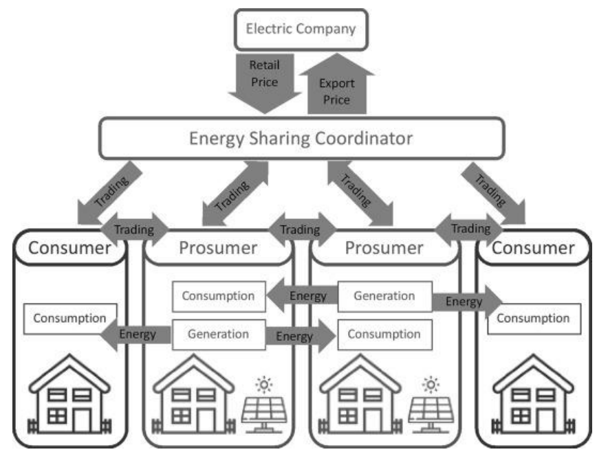
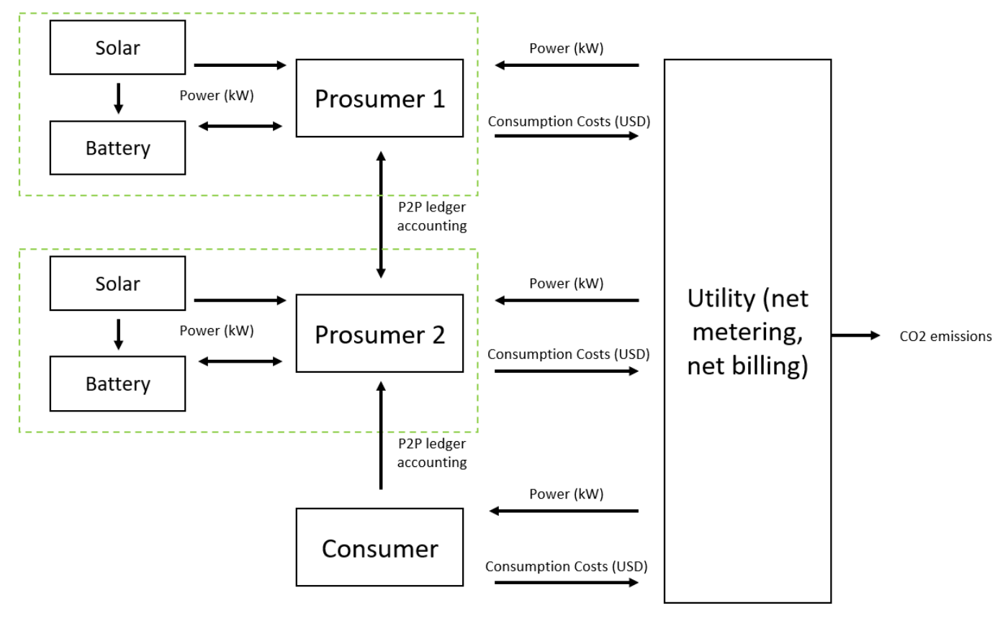

# Market Feasibility of Peer-to-Peer (P2P) Energy Accounting

This report analyzes customer data from a renewable energy consulting company and explores feasability of peer-to-peer energy trading within a local grid simulation. The main focus is exploring how this energy transfer technique can benefit customers given the current economics of net metering, solar energy generation and CO2 emissions reduction. 

[project report PDF link](energy_trading_analysis_report.pdf)

### P2P Energy Flow

### Microgrid Diagram

